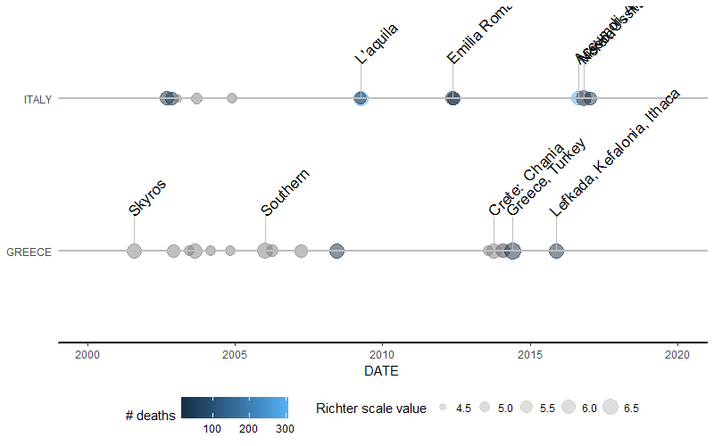

# earthquakeVis - NOAA earthquake visualization package

[](https://travis-ci.org/zkabat/earthquakeVis)

This is an R package created for the purpose of visualizing NOAA earthquake data. It processes data from [NOAA database](https://www.ngdc.noaa.gov/nndc/struts/form?t=101650&s=1&d=1). 

## Description

The package includes several exported functions to handle NOAA data. The provided data set includes data on earthquakes starting year 2150 B.C. and contains dates, locations, magnitudes, severity (casualties, injuries...) and other details. 

This package handles basic data cleaning using function `eq_clean_data()` and then two types of visualizations. The first is a `ggplot2`-based earthquake timeline of selected earthquakes using `geom_timeline()` and `geom_timeline_label()` with optional usage of `theme_timeline()` function. The second visualization is based on `leaflet` package and shows the earthquakes with some basic parameters on a map.

## Example

After downloading data from the NOAA database, the package is able to process and visualize them using the following example:

```r
filename <- system.file("extdata/earthquakes.tsv.gz", package = "earthquakeVis")
data <- readr::read_delim(filename, delim = "\t")
data %>% eq_clean_data() %>%
     filter(COUNTRY %in% c("GREECE", "ITALY"), YEAR > 2000) %>%
     ggplot(aes(x = DATE,
                y = COUNTRY,
                color = as.numeric(TOTAL_DEATHS),
                size = as.numeric(EQ_PRIMARY)
     )) +
     geom_timeline() +
     geom_timeline_label(aes(label = LOCATION_NAME), n_max = 5) +
     theme_timeline() +
     labs(size = "Richter scale value", color = "# deaths") + 
     scale_x_date(limits = c(lubridate::ymd("2000-01-01"), 
                             lubridate::ymd("2020-01-01")))
```


This creates a `ggplot2` object with earthquake timelines and labels grouped by country, colored by number of casualties and sized by magnitude. 

Another example uses leaflet package:

```r
data %>% 
  eq_clean_data() %>% 
  dplyr::filter(COUNTRY == "MEXICO" & lubridate::year(DATE) >= 2000) %>% 
  dplyr::mutate(popup_text = eq_create_label(.)) %>% 
  eq_map(annot_col = "popup_text")
```


The `leaflet` map includes circles for individual earthquakes with location name, magnitude and number of casualties annotations.

## Author

[Zdenek Kabat](https://github.com/zkabat)
